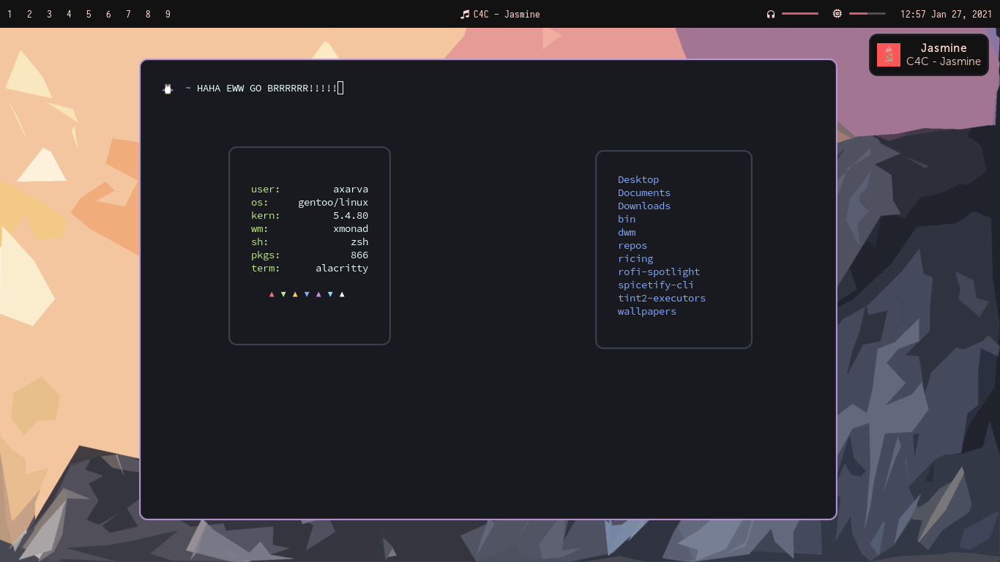

# Eww

Elkowars Wacky Widgets is a standalone widget system made in Rust that allows you to implement
your own, custom widgets in any window manager.

Documentation **and instructions on how to install** can be found [here](https://elkowar.github.io/eww).

Dharmx also wrote a nice, beginner friendly introductory guide for eww [here](https://dharmx.is-a.dev/eww-powermenu/).

## Eww needs your opinion!
I've hit a bit of a design roadblock for one of the bigger features that are in the works right now.

**Please read through https://github.com/elkowar/eww/discussions/453 and share your thoughts, ideas and opinions!**

## Examples

(Note that some of these still make use of the old configuration syntax.)

* A basic bar, see [examples](./examples/eww-bar)

* [Some setups by Druskus20](https://github.com/druskus20/eugh)

* [My own vertical bar](https://github.com/elkowar/dots-of-war/tree/master/eww-bar/.config/eww-bar)

* [Vertical Bar by Rxyhn](https://github.com/rxyhn/bspdots)

* [Setup by Axarva](https://github.com/Axarva/dotfiles-2.0)

* [Setup by adi1090x](https://github.com/adi1090x/widgets)

* [i3 Bar replacement by owenrumney](https://github.com/owenrumney/eww-bar)

* [Setups by iSparsh](https://github.com/iSparsh/gross)

* [topbar by saimoomedits](https://github.com/Saimoomedits/eww-widgets)

## Contribewwting

If you want to contribute anything, like adding new widgets, features, or subcommands (including sample configs), you should definitely do so.

### Steps
1. Fork this repository
2. Install dependencies
3. Smash your head against the keyboard from frustration (coding is hard)
4. Write down your changes in CHANGELOG.md
5. Open a pull request once you're finished
