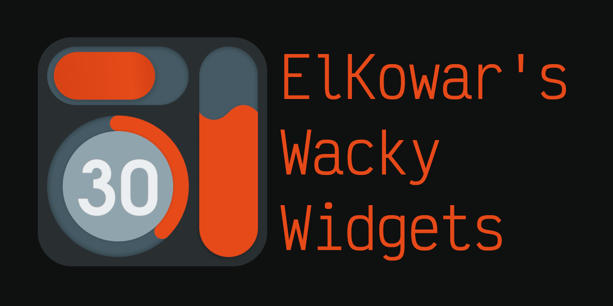

# About

Elkowar&rsquo;s Wacky Widgets is a standalone Widget System made in rust to add AwesomeWM like widgets to any WM

Documentation can be found [here](https://elkowar.github.io/eww/main)

# Contribewwting

If you want to contribute anything, like adding new widgets, features or subcommands (Including sample configs), you should definitly do so.

## Steps
1. Fork this repo
2. Install dependencies
3. Smash your head against the keyboard from frustration (coding is hard)
4. Open a pull request once you're finished.

# Examples 

An example of an eww bar: 

