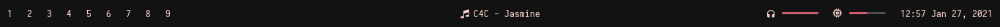

# Eww

Elkowar&rsquo;s Wacky Widgets is a standalone widget system made in Rust that allows you to implement
your own, custom widgets in any window manager.

Documentation **and instructions on how to install** can be found [here](https://elkowar.github.io/eww).

## New configuration language is being made!

A new configuration language for Eww is being made! `yuck` is the new name! (as discussed in the [discussion post](https://github.com/elkowar/eww/discussions/206).)
You can check out its development in [this PR](https://github.com/elkowar/eww/pull/221) and maybe contribewwte!

## Examples

* A basic bar, see [examples](./examples/eww-bar)

* [Setup by Axarva](https://github.com/Axarva/dotfiles-2.0)

* [Setup by adi1090x](https://github.com/adi1090x/widgets)

## Contribewwting

If you want to contribute anything, like adding new widgets, features or subcommands (Including sample configs), you should definitely do so.

### Steps
1. Fork this repository
2. Install dependencies
3. Smash your head against the keyboard from frustration (coding is hard)
4. Open a pull request once you're finished
