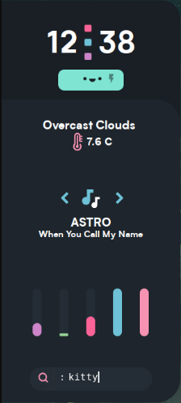

# Eww | *widgeting for the system*


Eww (ElKowar's Wacky Widgets) Is a widgeting system made in [rust](https://www.rust-lang.org/) similar to AwesomeWM's widgts, but works in **any** window manager.

Configured in XML it allows easy customizability and alot of flexibility which allows you to make amazing widgets.

This documentation is designed for very beginners and tries to simplify as much as possible so it's easier to understand.

## Contents

- [How to install Eww](#how-to-install-eww)
	- [Prerequisites](#prerequisites)
	- [Building](#building)
	- [Starting  Eww](#starting-eww)
-  [Configuration](#configuration)
	- [Placing the configuration file](#placing-the-configuration-file)
	- [Variables](#variables)
		- [The var tag](#the-var-tag)
		- [The script-var tag](#the-script-var-tag)
			- [Tail](#tail)
	- [The Definitions  block](#the-definitions-block)
		- [Custom Widgets](#custom-widgets)
	- [The Windows block](#the-windows-block)
    - [Widgets made in Eww](#widgets-made-in-eww)
- [GTK](#gtk)
	- [GTK-Temeing / Eww Themeing](#gtk-themeing)
	- [GTK-Debugger](#gtk-debugger)
- [Troubleshooting](#troubleshooting)
	- [My scss isn't being loaded](#my-scss-isnt-being-loaded)
	- [Eww can't find my configuration file](#eww-cant-find-my-configuration-file)
	- [Something isn't styled correctly!](#something-isnt-styled-correctly)


## How to install Eww 

### Prerequisites

* rustc
* cargo (nightly toolchain)

Rather than with your system package manager, I recommend installing it using  [rustup](https://rustup.rs/), as this makes it easy to use the nightly toolchain, which is necessary to build eww.

### Building

Once you have the Prerequisites ready, you're ready to install and build eww.

First clone the repo:
```bash
git clone https://github.com/elkowar/eww
```
then enter it.
```bash
cd eww
```
and then to build:
```bash
cargo build --release
```

### Running eww
Once you've built it you can now run it by entering:
```bash
cd target/release
```
and then make the Eww binary executable
```bash
chmod +x ./eww
```
and then to run it do
```
./eww open <window_name>
```
`<window_name>` is the name of the window, see [The windows block](#the-windows-block).

## Configuration

For specific built in widgets `<box>, <text>, <slider>, etc` see [Widget Documetation]()

### Placing the configuration file

The configuration file and the scss file should lay in your `$HOME/.config/eww` folder. The xml file should be named `eww.xml` and the scss should be named `eww.scss`
So the directory structure should look like this:
```
$HOME
└──.config
   └──eww
	  ├──eww.xml
	  └──eww.scss
```

### Variables

If you create a `<var>` or a `<script-var>`, you can reference them in your `<box>` by doing `{{var}}`. Where `var` is your variable name.

#### The `<var>` tag
Allows you to repeat the same text multiple times through  without retyping it multiple times.

Example:
```xml
<variables>
	<var name="banana">I like bananas.</var>
</variables>
```

and then reference it in your `<box>` by doing:
```xml
<box>
	{{banana}}
</box>
```
 the `banana` is the variable name we set by doing: 
 ```xml
 <var name="banana">
```
 If we were to set it to:
 ```xml
<var name="potatoes">
```
We would reference it by doing:
```xml
<box>
	{{potatoes}}
</box>
```
You can also change the variable name in CLI by doing:
```sh
eww update potatoes carrots
```
This will change the variable name `potatoes` to `carrots`

#### The `<script-var>` tag 

Allows you to create a script that eww runs.
Useful for creating volume sliders or anything similar.

Example: 
```xml
<variables>
	<script-var name="date" interval="5s">
	date +%H:%M
	</script-var>
</variables>
```

and then reference it by doing:
```xml
<box>
	{{date}}
</box>
```

The `interval="5s"` part says how long time it should take before Eww runs the command again.
Here are the available times you can set:
| Shortened | Full name | 
| :------------- | :----------:|  
| ms | Miliseconds |  
| s | Seconds |
| m | Minutes |  
| h | Hours | 

#### Tail
If you don't want a set interval and instead want it to tail (run the script when it detects a change is present) you can simply remove the `interval="5s"` so it becomes:
```xml
<variables>
	<script-var name="date">
	date +%H:%M
	</script-var>
</variables>
```

### The `<definitions>` block
In here you whole widget will be made, and you can also create your own widgets. Check [Widget Documentation]() for pre-defined widgets.

#### Custom widgets

Let's get a small config and break it down.

```xml
<definitions>
	<def name="clock">
		<box>
			The time is: {{my_time}} currently.
		</box>
	</def>
	<def name="main">
		<box>
			<clock my_time="{{date}}"/>
		</box>
	</def>
</definitions>

<variables>
	<script-var name="date">
		date
	</script-var>
</variables>
```
That's a long config just for a custom widget. But let's break it down and try to understand it.

This part:
```xml
	<def name="clock">
		<box>
			The time is: {{my_time}} currently.
		</box>
	</def>
```
Is the custom widget. As we can see by the 
```xml 
<def name="clock">
```
the widget is called `clock.`Or referenced `<clock>`
The `{{my_time}}` is the value we assign to be well, our time. You can actually set to be anything, it doesn't have to be a time. You can compare it to `value=""`

So if we look at:
```xml
	<def name="main">
		<box>
			<clock my_time="{{date}}"/>
		</box>
	</def>
```
we can see that we assign `{{my_time}}` to be `{{date}}` and if we look at 
```xml
	<script-var name="date">
		date
	</script-var>
```
we can see that `{{date}}` is simply running the `date` command.

It doesn't have to be `{{my_time}}` either, it can be anything.
```xml
	<def name="clock">
		<box>
			The time is: {{very_long_list_of_animals}} currently.
		</box>
	</def>
```
is valid.

To use that it would look like this:
```xml
	<def name="main">
		<box>
			<clock very_long_list_of_animals="{{date}}"/>
		</box>
	</def>
```
### The `<windows>` block

This is the part the Eww reads and loads. The `<windows>` config should look something like this:

```xml
<windows>
      <window name="main_window" stacking="fg">
        <size x="300" y="300" />
        <pos x="0" y="500" />
        <widget>
          <main/>
        </widget>
      </window>
</windows>
```
`<window name="main_window">` is the part that eww runs when you start it. In this example you would run eww by doing:
```bash
./eww open main_window
```
but if renamed the `<window>` to be `<window name="apple">` we would run eww by doing:
```bash
./eww open apple
```
You can also have multiple windows in one document by  doing:

```xml
<windows>
      <window name="main_window">
        <size x="300" y="300" />
        <pos x="0" y="500" />
        <widget>
          <main/>
        </widget>
      </window>
      <window name="main_window2">
	   <size x="400" y="600"/>
	   <pos x="0" y="0"/>
	   <widget>
		<main2/>
	   </widget>
      </window>
</windows>
```
---

`<size>` sets x-y size of the widget.
`<pos>` sets x-y position of the widget.
`<widget>` is the part which you say which `<def>` eww should run. So if we take the example config from before:
```xml
<definitions>
	<def name="clock">
		<box>
			The time is: {{my_time}} currently.
		</box>
	</def>
	<def name="main">
		<box>
			<clock my_time="{{date}}"/>
		</box>
	</def>
</definitions>
```
and then look at
```xml
        <widget>
          <main/>
        </widget>
```
we will see that eww will run `<def name="main">` and not `<def name="clock">`.

### Widgets made in Eww

 


## GTK

### Gtk-Themeing

Eww is styled in GTK CSS or SCSS as it's called. If you don't know any way to style something check out the [GTK CSS Overview wiki](https://developer.gnome.org/gtk3/stable/chap-css-overview.html), the [GTK CSS Properties Overview wiki ](https://developer.gnome.org/gtk3/stable/chap-css-properties.html). Or check the [GTK-Debugger](#gtk-debugger)

If you have **NO** clue about how to do CSS, check out some online guides or tutorials.

SCSS is *very* close to CSS so if you know CSS you'll have no problem learning SCSS.

### GTK-Debugger

The debugger can be used for **a lot** of things. Especially if something doesn't work or isn't styled right. to enable it do
```bash
GTK_DEBUG=interactive ./eww open main_window
```
or in fish
```bash
env GTK_DEBUG=interactive ./eww open main_window
```

If a style or something similar doesn't work you can click on the icon in the top left icon to select the thing that isn't being styled or isn't being styled correctly.

Then you can click on the drop down menu in the top right corner and select CSS Nodes, here you will see everything about styling it, CSS Properties and how it's structured.

## Troubleshooting

Here you will find help if something doesn't work, if the issue isn't listed here please [open an issue on the github repo.](https://github.com/elkowar/eww/issues)

### My scss isn't being loaded!

1. You have not created a scss file
2. The scss file isn't called correctly. (it should be called `eww.scss` in the `$HOME/.config/eww` folder)
3. The scss file isn't placed in the correct location (check above)
4. You have used two (or more) semi-colons (;;) insted of one (;) at the end of a line.

If none of these fixed your problem [open an issue on the github repo.](https://github.com/elkowar/eww/issues) Or check the [GTK-Debugger](#gtk-debugger).

### Eww can't find my configuration file!

1. It's incorrectly named or it's in the wrong place  (it should be called `eww.xml` in the `$HOME/.config/eww` folder)
2. You haven't started eww correctly or you started it wrong. (See [Starting  Eww](starting-eww))

### Something isn't styled correctly!

1. You have misstyped the CSS class.
2. Check the [GTK-Debugger](#gtk-debugger)

Remeber if your issue isn't listed here,  [open an issue on the github repo](https://github.com/elkowar/eww/issues).
